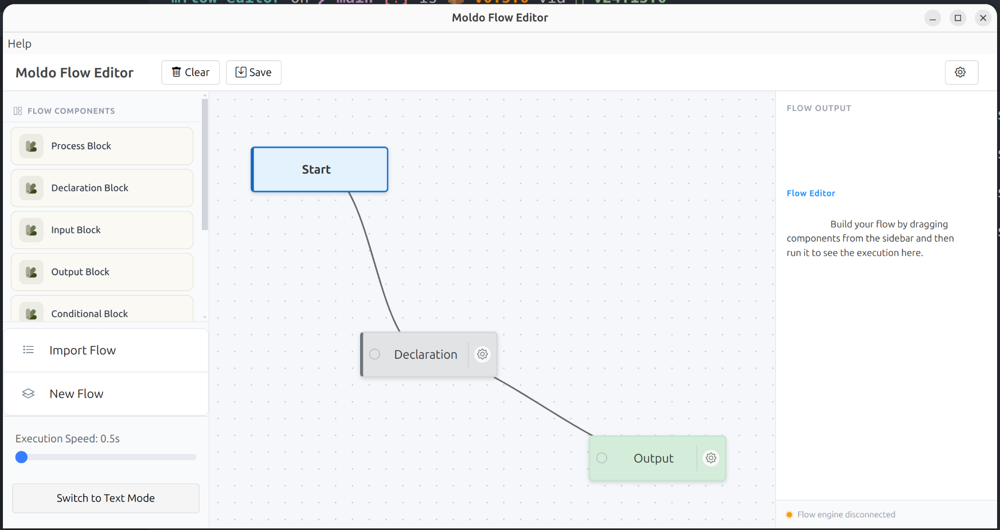

# Moldo Flow Editor

> A visual, flowchart-based programming environment that compiles to Python - built for learners.



---

## What is Moldo Flow Editor?

**Moldo Flow Editor** (mflow-editor) is the official visual editor for the **Moldo programming language** - an educational tool that lets you build programs by drawing flowcharts instead of writing code. Each flowchart you design compiles directly to Python, making it a natural bridge for beginners stepping into programming for the first time.

Whether you're a student, teacher, or curious learner, Moldo Flow Editor gives you a canvas to think visually and produce real, runnable code.

---

## Getting Started

### Step 1 - Install the Moldo Runtime

The editor requires the **Moldo runtime** to compile and run your flowcharts. Install it from PyPI:

```bash
pip install moldo
```

[](https://pypi.org/project/moldo/)
[](https://moldo.readthedocs.io/en/latest/?badge=latest)

→ [**View on PyPI**](https://pypi.org/project/moldo/) &nbsp;&nbsp; → [**Read the Docs**](https://moldo.readthedocs.io/en/latest/?badge=latest)

---

### Step 2 - Download the Editor

Pick the installer for your platform:

<table>
  <tr>
    <td align="center" width="200">
      <a href="https://github.com/GracePeterMutiibwa/mflow-editor/releases/latest">
        <br/>
        <strong>Linux</strong>
      </a><br/>
      <sub>.AppImage / .deb</sub>
    </td>
    <td align="center" width="200">
      <a href="https://github.com/GracePeterMutiibwa/mflow-editor/releases/latest">
        <br/>
        <strong>Windows</strong>
      </a><br/>
      <sub>.exe installer</sub>
    </td>
    <td align="center" width="200">
      <a href="https://github.com/GracePeterMutiibwa/mflow-editor/releases/latest">
        <br/>
        <strong>macOS</strong>
      </a><br/>
      <sub>.zip app bundle</sub>
    </td>
  </tr>
</table>

All releases are available on the [**Releases page**](https://github.com/GracePeterMutiibwa/mflow-editor/releases).

> **Linux users:** The `.AppImage` requires no installation - just make it executable and run it. The `.deb` package can be installed via your package manager.
>
> **macOS users:** The app is currently unsigned. You may need to allow it under System Settings → Privacy & Security after opening.

---

### Step 3 - Start Learning

Once the editor is open and the runtime is installed, you're ready to go. Draw your first flowchart, hit **Run**, and watch it come to life as Python.

Check out the full documentation to learn about available blocks, flow structures, and how to compile your programs:

→ [**Moldo Documentation**](https://moldo.readthedocs.io/en/latest/?badge=latest)

---

## About

Moldo Flow Editor is developed to give a face to the Moldo Runtime

- **Author:** Grace Peter Mutiibwa
- **License:** MIT
